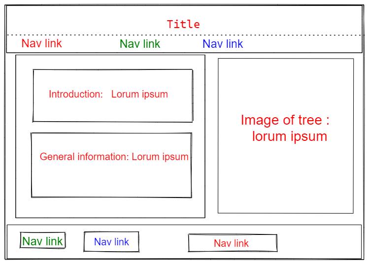

# All about trees

> This is a website introduces trees and nature 🌲🌿, here you will find a lot
> of information including but not limited to:

- Why are trees important
- How can we keep them alive
- Links to other resources

## Table of content

- [Tools](#technology-and-tools-we-used)
- [Screenshot](#screenshot)
- [Features](#features)
- [Setup](#setup)
- [TeamMembers](#team-members)

## Technology and tools we used

- HTML
- Git
- Css

## Screenshot

## Features

All-About-Trees includes following parts

- Heading
  - Title
  - Navbar
- Main section
  - Side Info
  - Main Info
  - Pictures
- Footer
  - Social Links and other resources

## Setup

> We took following steps to accomplish our goal:

1.Cloned template from previous repo.

2.Inviting members to the new group 4 repo.

3.Making plans and distributing tasks.

4.Everyone makes issue and code for each task.

## Team Members

- Marina
- Xin
- Neha
- Belkis
